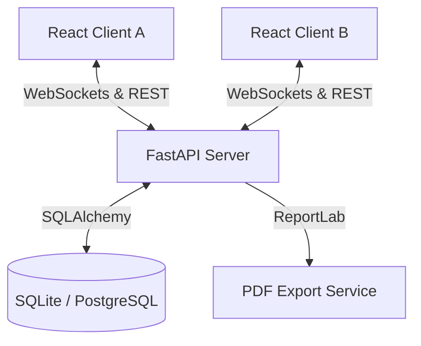

NAME:- VIKAL PANDEY 
COMPANY:- CODTECH IT SOLOUTIONS 
INTERN ID :- CTIS8713 
MENTOR:- Neela Santhosh 
Duration:- 6 Weeks 
Domain:- Software Development

#OUTPUT#
https://github.com/VIKAL-PANDEY/CollabNotes/issues/1#issue-4619091171


# CollabNotes 📝

CollabNotes is a high-performance, production-ready **Real-Time Collaborative Note-Taking Platform** similar to Google Docs. It leverages **FastAPI**, **WebSockets**, and **SQLAlchemy** on the backend, and **React.js** with **Tailwind CSS** on the frontend to deliver instantaneous document synchronisation.

---

## 🚀 Key Features

- **Real-Time Editing**: Instant synchronisation of edits across all connected users using native WebSockets.
- **Collaborative Cursors & Selections**: Visual tracking displaying which character index other collaborators are working on.
- **Presence Indicators & Typing Alerts**: Live avatar headers of active users in the document and real-time typing indicators.
- **Version History Snapshots**: Automatic, debounced revision history snapshots allowing editors/owners to preview and restore documents to previous versions.
- **Secure Sharing & Permissions**: Fine-grained access control permitting owners to share documents with editors (read-write) or viewers (read-only).
- **PDF Export**: Single-click PDF compiling and download service.
- **Comprehensive Activity Logging**: Persistent audit trail logging user registrations, login sessions, document creations, updates, shares, and exports.
- **Responsive Dark Theme UI**: Premium SaaS glassmorphism layout, loading skeletons, and custom animated toast notifications.

---

## 🏗️ Architecture



### WebSocket Event Protocol
- `join_document` / `user_joined`: Dispatched on socket connection to track user presence.
- `leave_document` / `user_left`: Broadcasted to sync active users lists on disconnect.
- `document_update`: Sends live text changes across the document.
- `user_typing`: Broadcasts active keystrokes status.
- `cursor_move`: Syncs cursor index offsets.

---

## 🛠️ Tech Stack

- **Backend**: FastAPI (Python), WebSockets, SQLAlchemy, PyJWT, ReportLab (PDF), Passlib & Bcrypt (Password Hashing).
- **Frontend**: React.js, Vite, Tailwind CSS, Axios, Lucide Icons, React Router.
- **Database**: SQLite (default fallback) / PostgreSQL.
- **Deployment**: Docker, Docker Compose.

---

## 💻 Installation & Local Development

### Prerequisites
- Python 3.10+
- Node.js 18+
- Docker & Docker Compose (Optional)

### Running Locally (Without Docker)

#### 1. Setup Backend
1. Navigate to the backend directory:
   ```bash
   cd backend
   ```
2. Create and activate a virtual environment:
   ```bash
   python -m venv venv
   # On Windows:
   .\venv\Scripts\activate
   # On Linux/macOS:
   source venv/bin/activate
   ```
3. Install dependencies:
   ```bash
   pip install -r requirements.txt
   ```
4. Run the FastAPI development server:
   ```bash
   uvicorn app.main:app --reload
   ```
   The backend will run on `http://localhost:8000`.

#### 2. Setup Frontend
1. Navigate to the frontend directory:
   ```bash
   cd ../frontend
   ```
2. Install dependencies:
   ```bash
   npm install
   ```
3. Run the Vite development server:
   ```bash
   npm run dev
   ```
   The frontend will run on `http://localhost:5173`.

---

### Running via Docker Compose

Run the entire stack in one command from the project root:
```bash
docker-compose up --build
```
This builds and runs:
- Backend: `http://localhost:8000`
- Frontend: `http://localhost:5173`

---

## 🌐 API Reference

### Auth
- `POST /api/auth/register`: Create a new user account.
- `POST /api/auth/login`: Authenticate and receive a JWT token.
- `GET /api/auth/me`: Retrieve current logged-in user profile.

### Documents
- `GET /api/documents`: List documents owned by/shared with user (supports query search `?search=`).
- `POST /api/documents`: Create a new document.
- `GET /api/documents/{id}`: Fetch document by ID.
- `PUT /api/documents/{id}`: Update title/content (creates new version).
- `DELETE /api/documents/{id}`: Delete document (restricted to Owner).
- `GET /api/documents/{id}/history`: Fetch document version revision lists.
- `GET /api/documents/{id}/export`: Download document as PDF (JWT token passed as query parameter).

### Sharing
- `POST /api/documents/{id}/share`: Share document with another user (Viewer/Editor permissions).
- `GET /api/documents/{id}/users`: List users having access to the document.

### WebSockets
- `WS /ws/document/{document_id}?token={token}`: Real-time socket room synchronization.

---

## ☁️ Deployment Guides

### Backend (Render)
1. Sign up/Login to [Render](https://render.com).
2. Click **New +** and select **Web Service**.
3. Link your Github Repository and specify the root directory as `backend`.
4. Configure setting values:
   - **Environment**: `Python`
   - **Build Command**: `pip install -r requirements.txt`
   - **Start Command**: `uvicorn app.main:app --host 0.0.0.0 --port $PORT`
5. Add Environment Variables in settings:
   - `JWT_SECRET`: (Your secret key)
   - `DATABASE_URL`: (PostgreSQL database link provided by Render DB)

### Frontend (Vercel)
1. Sign up/Login to [Vercel](https://vercel.com).
2. Click **Add New** and select **Project**.
3. Import your repository.
4. Select `frontend` as the **Root Directory**.
5. Keep default build settings (Vite is auto-detected).
6. Set Environment Variables:
   - `VITE_API_URL`: (Your backend URL on Render, e.g. `https://collabnotes-backend.onrender.com`)
7. Click **Deploy**.
